<center></center>

# Bookcatalog Console .Net Application

In this repository you find the application I made for my internship at Cegeka

## The ReadMe
### Versions: 
  - [v1.0 ReadMe](Documentation/README.v1.md)
  - [v2.0](#)

### Table of contents:
- [Bookcatalog Console .Net Application](#bookcatalog-console-net-application)
  - [The ReadMe](#the-readme)
    - [Versions:](#versions)
    - [Table of contents:](#table-of-contents)
  - [Application](#application)
  - [What does the application do](#what-does-the-application-do)
  - [Setup](#setup)
    - [How to setup the application](#how-to-setup-the-application)
  - [Usage](#usage)
    - [Start the application](#start-the-application)
      - [Database](#database)
    - [Start](#start)
      - [Terminal display](#terminal-display)
- [Screens](#screens)
  - [Navigation](#navigation)
    - [Search](#search)
    - [Login Partial](#login-partial)
  - [Homescreen](#homescreen)
  - [Books screen](#books-screen)
  - [BookDetail](#bookdetail)
  - [Account](#account)
    - [Register](#register)
    - [Login](#login)
    - [Editing the account](#editing-the-account)
    - [Search](#search-1)
  - [Authorization](#authorization)
    - [Adding a Book](#adding-a-book)
    - [Updating](#updating)
    - [Delete](#delete)
  - [About the code of the application](#about-the-code-of-the-application)
    - [Modify](#modify)
    - [Tests](#tests)
  - [Principles Used](#principles-used)
    - [Single Responsibility Principle (SRP)](#single-responsibility-principle-srp)
      - [Dependency injection](#dependency-injection)
        - [Dependency Container](#dependency-container)
    - [Interface Segregation Principle](#interface-segregation-principle)
    - [Reflection](#reflection)
    - [Generic Repository structure](#generic-repository-structure)
  - [File Structure](#file-structure)
        - [Author: Ewoud Forster](#author-ewoud-forster)


## Application
This is a ASP.NET application existing out of pages for managing a book catalog


## What does the application do
The application is a used as a management system for books. You can add, update, delete, search for certain books as well as viewing statistics of the specific book. There is also a searching feature that supports live searching as well as filtering on Genre. There is an API with needed endpoints for using in another application.

## Setup
### How to setup the application
To run this application, first you download the folder [v2.x](Published Application/v2.x) or go to the releases in the repository and download the latest release there. You now unzipping the folder.


## Usage
### Start the application
you go to the "v2.x" Folder and start the "BookCatalog.exe" file. The Application will start.

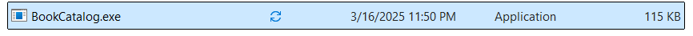

#### Database
In the program.cs file it is declared that the migration file will run if the database doesn't exist yet it will be created and seeded, so no need for creating the database. 

### Start
You see the terminal opening up to start the application, normally the Application starts in the browser. If not the terminal shows the specific port the application is running on, you can "Ctrl + Click" on this link to open in the browser

#### Terminal display

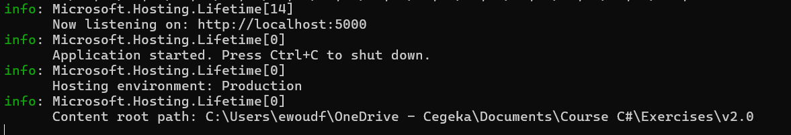

# Screens
There are a few screens created with ASP.NET, most screens are created with MVC, some with Razorpages, Search is created with Blazorpages

## Navigation


When you open the application, the first screen you see is the homepage, at the top of the screen you see the navbar, that is embedded in the layout file, using a partial. The navbar itself has a logo, 2 mvc links using ASP.NET taghelpers to generate a link to a specific action in a chosen controller. 

The navbar is responsive for smaller devices

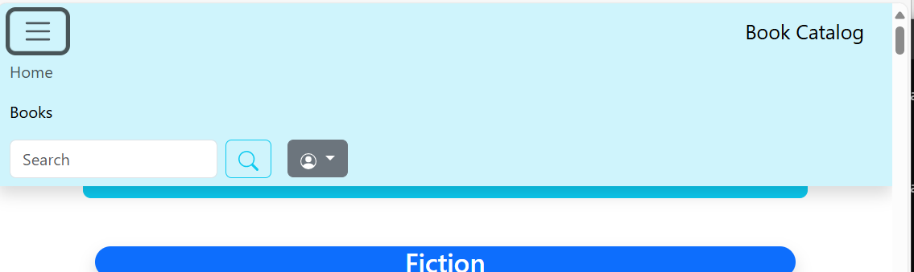

### Search
Then we have the searchbar which is a form that takes a parameter and put it into the url and then brings it to the blazor search page, here the url gets read and the parameter gets taken out and used as a search parameter


### Login Partial
To the farthest right of the screen is another partial that is a dropdown link, it uses bootstrap.min.js, and specifically the popper library that enables the dropdown link. Bootstrap is used for the styling, inside the partial AspNetCore.Identity is used to determine if a user is logged in or not, when not logged in the options are Register and Login  

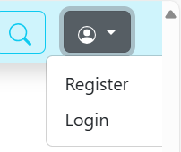

When you are logged in the options you get are your account, which brings you to your account dashboard where you can edit your account, or the logout option to logout.

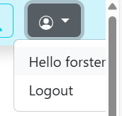

## Homescreen
On the homescreen itself you see the latest statistics being read out of the database, this part is actually adjustable in the controller of the page, you can choose on what part of data the statistics are calculated on.

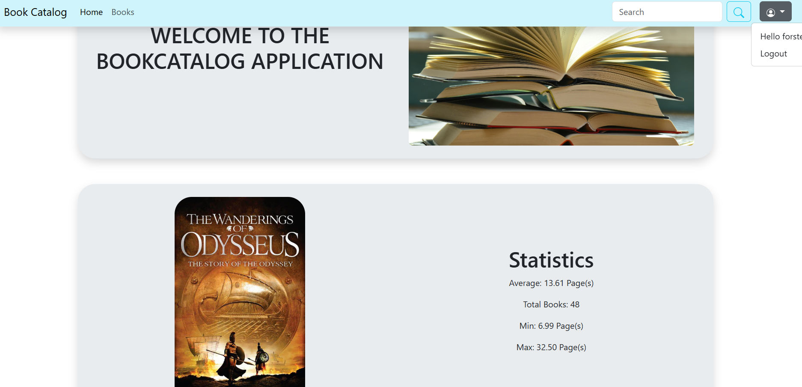

These are the options you can get all statistics on, only numeric values of course, the rest of the methods in the repository are also adjustable using all the possible values.
```
    public enum BookByStatsOptions
    {
        Year,
        Price,
        Page,
    }
```
## Books screen
When we nagivate to the book screen we see all the books that are in the database grouped by their genre, I used bootstrap card elements to give a good overview and keep responsivity on different devices.

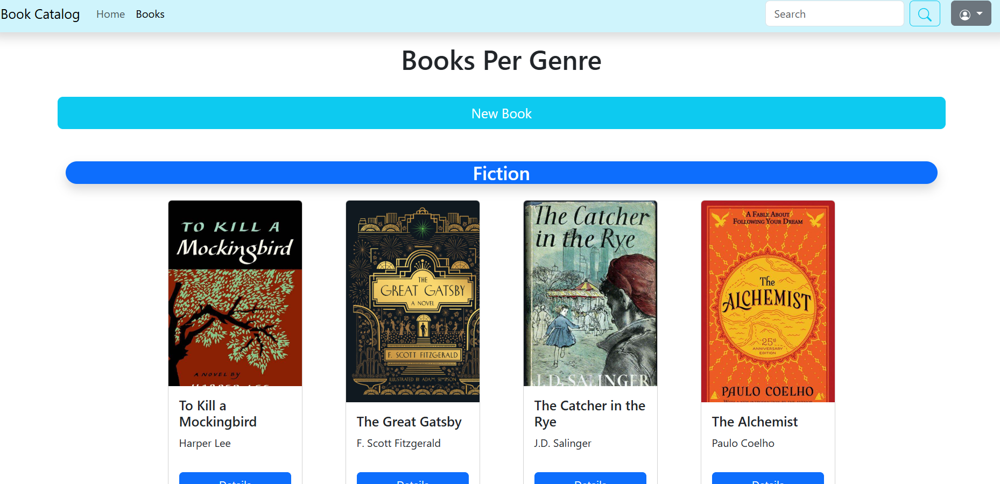

## BookDetail

When pressing on the detail button of a specific book you get the details page of this book showing the cover, The title, the author, genre and the price, here you can also to edit the book or delete the book. For these actions a login is required.

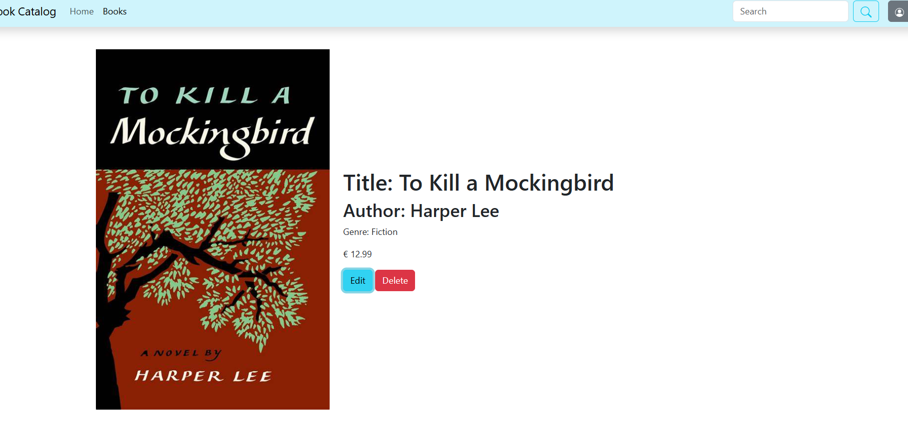

## Account

The authentication and authorization is part of the library provided by Entity Framework Core, we can customize it as hard as we want but this is not required. Scaffolding is used for the pages related the account, the logic is read out of this scaffolding library but it is possible to customize this pages as hard as we want.

### Register
This page is for new user who do not have an account yet, therefor they can use to screen to make a new account, there is the possibility to use third party providers for registering a user, but i removed this part in the screen, I also styled the screen to match the rest of the screen.

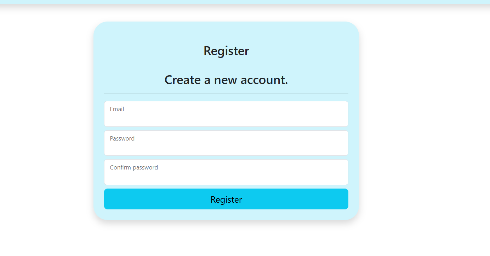

### Login

This page is as the name explains to log in as a user with an existing account, the page is minimally adjusted by me just to match the layout of the rest of the webapplication also the login screen is centered. You have the possibly to login, or register with third party providers like google, or microsoft, I have this not set up so I removed this part of the screen.

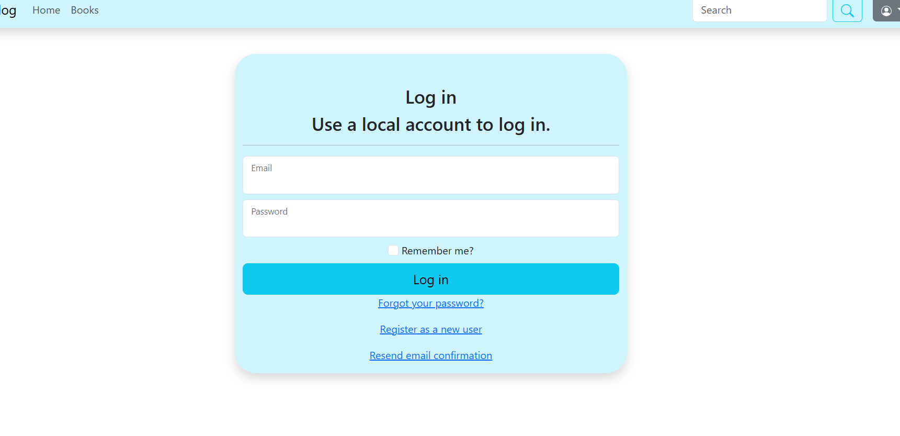

### Editing the account
This page is not edited by me except the colors to match my layout, as you can see it is easily to integrate without making any changes.

Here you can change your account, it is also possible to setup Two-factor authentication. You can also download or delete your personal data

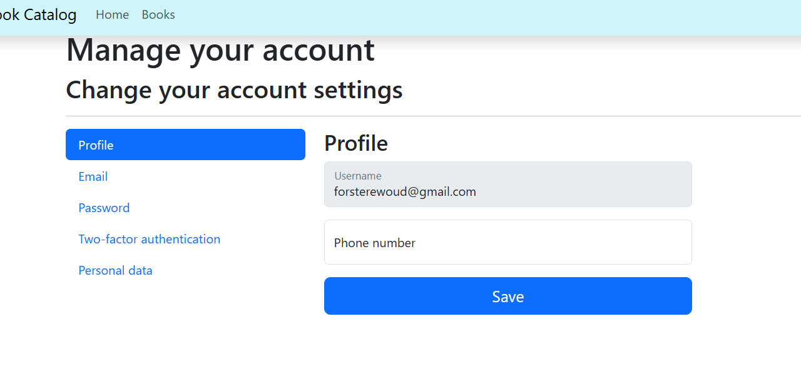
### Search

Using a blazor page the search page is build to get the search query which is coupled to a property in the class of this page that will use the search method in the repository to see if the book exist or if there are more books that match this search criteria. You can also filter on a specific genre, If you put in an Id it is also possible to get a result, the class try's to parse the Id in a GUID and searches for a result, if there is a result this will be returned if not it will look for the other search method with the parameter given.

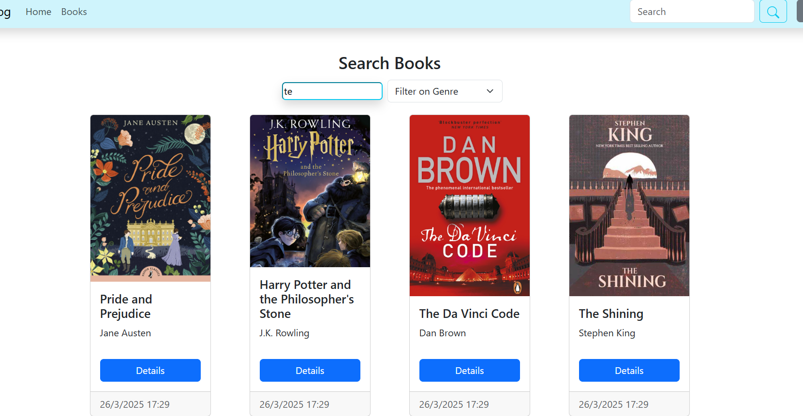

## Authorization
As said before already EF Core Identity is used to block certain actions for a not logged in user, all following actions require a login of the user.

### Adding a Book
When adding a book you get a form to fill in with all the input fields for each property in a book.

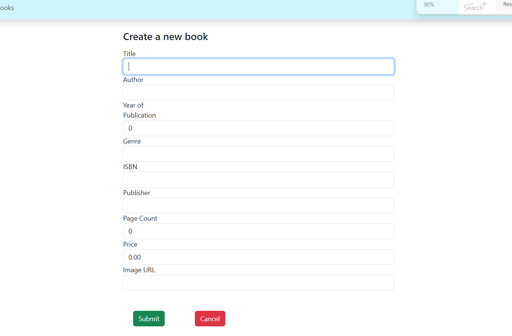

The Page uses back and front end validation, meaning that a book that doesn't match the validation rules will not be added to the database and return the page with the book filled in the form again, but that the user also gets realtime data saying where to adjust the form, using Jquery

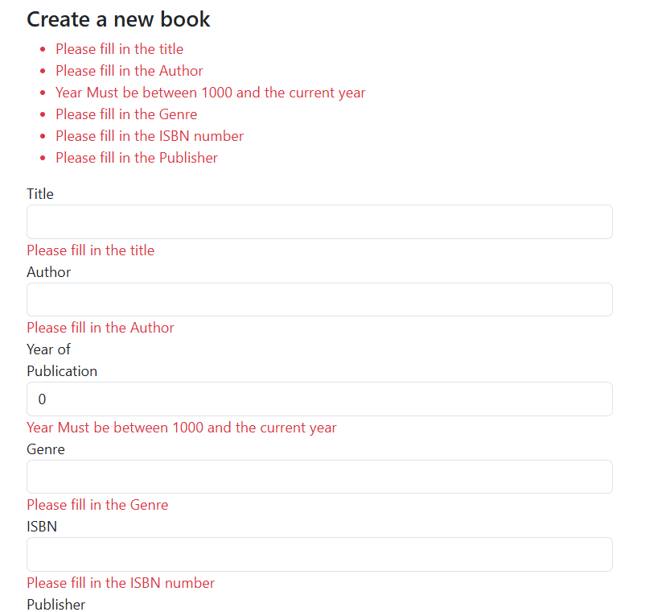

When clicking on submit the page will create the Book, when clicking cancel the page books get returned again.

### Updating
When going to the details page of a specific book you can choose to edit a book, when doing this you get the same form for filling in a new book, this time filled in with the book we want to edit. When creating a book it is always available, but here we can make it unavailable. The same validation is for this screen, because it is the exact same screen and method, it just checks the parameter that is checked when a book is updated instead of a new book is added.

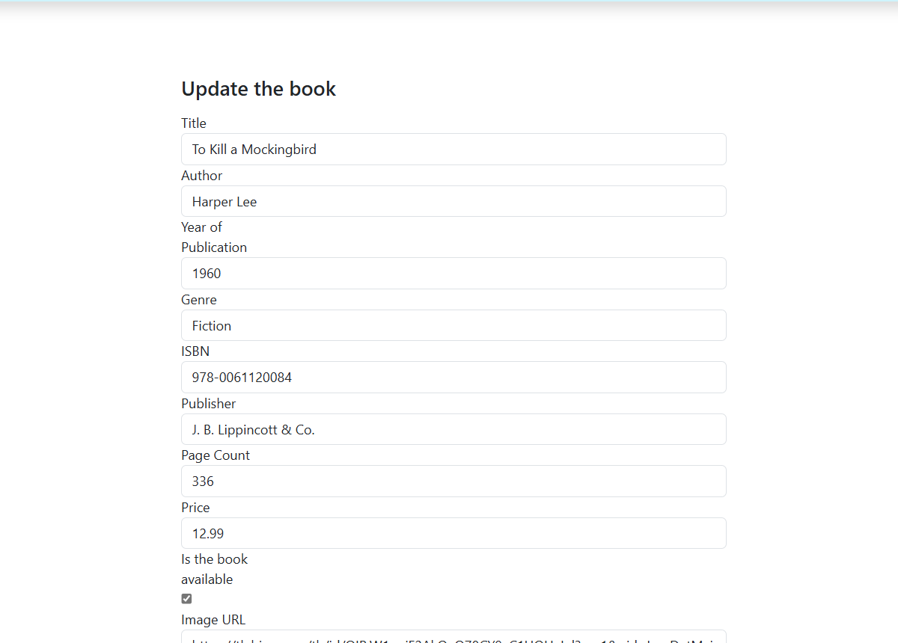

### Delete
When going to a detail page you can press delete which deletes the book out of the database

## About the code of the application
### Modify
If you want to make modifications you need to go into the application folder, open the IDE you want to use, best Visual Studio. When you make your modifications, and you are ready, you can publish the application again. Now you again go to the PublishedApplication folder and you are done.

### Tests
In the solution there is a project dedicated to tests, in here the specific functionalities are tested, there are 21 tests and they are all successful

v2.x: For The ASP.NET part of the application 3 Tests were added, for each controller there is, So in total there are 24 Tests

There are tests for following functionalities:
- Controllers:
    - BookController 
    - HomeController
- Genericrepository:
    - Searching 
    - Adding
    - Updating
    - Deleting
- LINQ:
    - OrderByTitle
    - OrderBy Price
    - OrderByPublisher
    - OrderByPublicationYear
    - OrderByPageCount
    - Search By Title
    - Search By Test
    - Search By Genre
    - Search By Author
- Logger
    - String output
    - Exception output
- Generic File System, you can choose the file format (CSV, JSON, CSV by reflection):
    - Saving
    - Reading

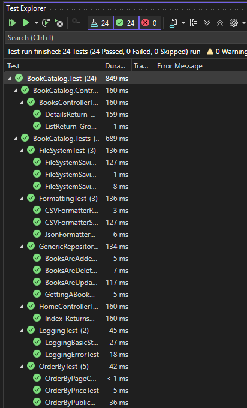

## Principles Used
### Single Responsibility Principle (SRP)
I put every responsibility in a separate file, so 1 file only has 1 specific responsibility.
Also was I making a RepositoryFactory, which I will definitely fix in the future. 

#### Dependency injection
I use dependency injection on every place a class relies on another instance of a class, I don't let the class create the instance itself, that's why I pass it in the constructor as a parameter in a lot of places to minimize the responsibility of a class.

##### Dependency Container
Now with the ASP.NET project it is even easier using dependency injection using the dependency injection container that will fill in a parameter where asked for, in this case I use it for every controller using a repository that is the same the whole request.

###	Interface Segregation Principle
Every interface that is implemented is implemented fully. There are no implemented interfaces with unused

### Reflection
I've used reflection for trying to make the RepositoryFactory. As well as showing the properties of a specific book. Reflection is also used for getting the file path where the JSON file needs to be saved in.

### Generic Repository structure
The repository is generic, you can use this on any project without changing a thing.


## File Structure
I tried to make a clear and easy to navigate solution structure. Here you can find the structure.
```
BookCatalog
|
├───BookCatalog (Solution)
│   ├───BookCatalog
│   │   ├───wwwroot
│   │   │   ├───CsvFormatterReflection.cs
│   │   │   │───ISerialize.cs
│   │   │   └───Lib
│   │   │       ├───bootstrap
│   │   │       ├───jquery
│   │   │       ├───jquery-validation
│   │   │       └───jquery-validation-unobtrusive
│   │   │
│   │   ├──App
│   │   │   ├───_Import.razor
│   │   │   ├───App.razor
│   │   │   ├───Routes.razor
│   │   │   ├───Layout
│   │   │   │   ├───MainLayout.razor
│   │   │   │   └───NavMenu.razor
│   │   │   │
│   │   │   └───Pages
│   │   │       ├───BookCard.razor
│   │   │       ├───BookCard.razor.cs
│   │   │       ├───SearchBlazor.razor
│   │   │       ├───SearchBlazor.razor.cs
│   │   │       └───Error.razor
│   │   │   
│   │   ├──Areas
│   │   │   └───Identity
│   │   │       └───Pages
│   │   │           ├───Account
│   │   │           │   ├───_ViewImports.cshtml
│   │   │           │   ├───Login.cshtml
│   │   │           │   ├───Login.cshtml.cs
│   │   │           │   ├───Logout.cshtml
│   │   │           │   ├───Logout.cshtml.cs
│   │   │           │   ├───Register.cshtml
│   │   │           │   └───Register.cshtml.cs
│   │   │           │
│   │   │           ├───_ValidationScriptsPartial.cshtml
│   │   │           ├───_ViewImports.cshtml
│   │   │           └───_ViewStart.cshtml
│   │   │   
│   │   ├───Controllers
│   │   │   ├───Api
│   │   │   │   │───BookController.cs
│   │   │   │   └───BookSearchController.cs
│   │   │   │───TagHelpers
│   │   │   │───BooksController.cs
│   │   │   │───SearchMvcController.cs
│   │   │   └───HomeController.cs
│   │   │ 
│   │   ├───Pages
│   │   │   │───_ViewImports.cshtml
│   │   │   │───_ViewStart.cshtml
│   │   │   ├───BookForm.cshtml
│   │   │   └───BookForm.cshtml.cs
│   │   │  
│   │   │───Views
│   │   │   │───Books
│   │   │   │   ├───Details.cshtml
│   │   │   │   └───List.cshtml
│   │   │   │  
│   │   │   │───Home
│   │   │   │   └───Index.cshtml
│   │   │   │  
│   │   │   │───SearchMvc
│   │   │   │   └───Index.cshtml
│   │   │   │  
│   │   │   │───Shared
│   │   │   │   ├───_BookCard.cshtml
│   │   │   │   ├───_CarouselBooks.cshtml
│   │   │   │   ├───_Layout.cshtml
│   │   │   │   ├───_LoginPartial.cshtml
│   │   │   │   └───_NavPartial.cshtml
│   │   │   │  
│   │   │   │───ViewModels
│   │   │   │   ├───Details.cshtml
│   │   │   │   └───List.cshtml
│   │   │   │  
│   │   │   │───_ViewImports.cshtml
│   │   │   └───_ViewStart.cshtml
│   │   │  
│   │   │───appsettings.json
│   │   └───Program.cs
│   │     
│   ├───BookCatalog.AppHost
│   │   │───appsettings.Development.json
│   │   │───appsettings.json
│   │   └───Program.cs
│   │     
│   ├───BookCatalog.ConsoleApplication
│   │   └───Program.cs
│   │     
│   ├───BookCatalog.ServiceDefaults
│   │   └───Extensions.cs
│   │
│   └───BookCatalog.DataLayer
│       ├───Migrations
│       │   └───(Migration Files)
│       │
│       ├───Models
│       │   ├───Book.cs
│       │   │───EntityBase.cs
│       │   │───IEntity.cs
│       │   └───Logging
│       │       ├───ILogger.cs
│       │       └───Logger.cs
│       │
│       ├───Repositories
│       │   │───Book
│       │   │   │───BookRepository.cs
│       │   │   └───IBookRepository.cs
│       │   │   
│       │   │───Generic
│       │   │   │───GenericRepository.cs
│       │   │   ├───IReadRepository.cs
│       │   │   │───IRepository.cs
│       │   │   └───IWriteRepository.cs
│       │   │
│       │   └───RepositoryFactory
│       │       │───LoadContext.cs
│       │       └───RepositoryFactory.cs
│       │
│       │
│       ├──Services
│       │   ├───BookService.cs
│       │   ├───ConsoleHelper.cs
│       │   └───LINQ
│       │
│       └───Storage
│           │───DataBase
│           └───FileStorage
│               ├───Filesystem
│               │   │───FileSystem.cs
│               │   └───IFileSystem.cs
│               │
│               └───Formatting
│                   │───CsvFormatter.cs
│                   ├───CsvFormatterReflection.cs
│                   │───ISerialize.cs
│                   └───JsonFormatter.cs
│   
└───BookCatalog.Tests
    ├───ControllerTest
    │   ├───BookControllerTest.cs 
    │   └───HomeControllerTest.cs
    │   
    ├───LoggingTests
    │   └───LoggingTest.cs
    │
    ├───LoggingTests
    │   └───RepositoryMocks.cs
    │
    ├───LINQTests
    │   ├───OrderByTest.cs
    │   └───Search.cs
    │
    └───Repositories
        └───FileTests
            ├───FileSystemTest.cs 
            ├───FormattingTest.cs 
            └───GenericRepositoryTest.cs   

```

##### Author: Ewoud Forster
