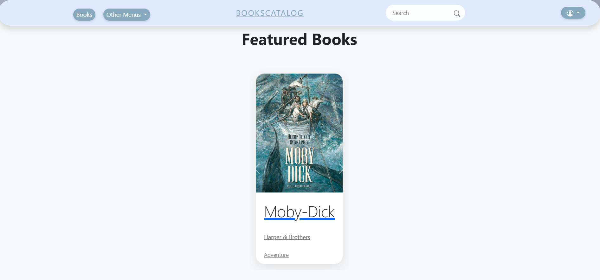
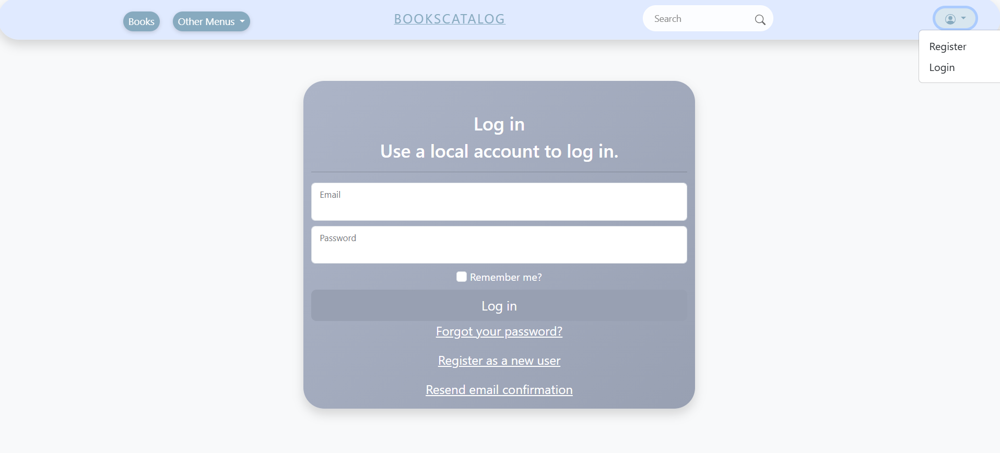

<center></center>


# BookCatalog .NET Application Suite

Welcome to the BookCatalog .NET Application Suite repository! This project showcases a comprehensive solution for managing a book catalog, comprising a robust ASP.NET Core API and a modern .NET MAUI mobile application. This suite was developed as part of an internship at Cegeka.

-----

## Table of Contents

  - [BookCatalog .NET Application Suite](https://www.google.com/search?q=%23bookcatalog-net-application-suite)
      - [The ReadMe](https://www.google.com/search?q=%23the-readme)
          - [Versions](https://www.google.com/search?q=%23versions)
          - [Table of Contents](https://www.google.com/search?q=%23table-of-contents)
      - [Overview](https://www.google.com/search?q=%23overview)
          - [Key Features](https://www.google.com/search?q=%23key-features)
      - [Project Architecture](https://www.google.com/search?q=%23project-architecture)
          - [ASP.NET Core API](https://www.google.com/search?q=%23aspnet-core-api)
          - [.NET MAUI Mobile Application](https://www.google.com/search?q=%23net-maui-mobile-application)
          - [Core Principles & Design Patterns](https://www.google.com/search?q=%23core-principles--design-patterns)
      - [Setup & Installation](https://www.google.com/search?q=%23setup--installation)
          - [Prerequisites](https://www.google.com/search?q=%23prerequisites)
          - [Getting Started](https://www.google.com/search?q=%23getting-started)
              - [Database Setup](https://www.google.com/search?q=%23database-setup)
              - [Running the API](https://www.google.com/search?q=%23running-the-api)
              - [Running the MAUI Application](https://www.google.com/search?q=%23running-the-maui-application)
      - [Usage](https://www.google.com/search?q=%23usage)
          - [Web Application (ASP.NET Core)](https://www.google.com/search?q=%23web-application-aspnet-core)
              - [Home Page](https://www.google.com/search?q=%23home-page)
              - [Authentication & Authorization](https://www.google.com/search?q=%23authentication--authorization)
              - [Books Management](https://www.google.com/search?q=%23books-management)
              - [Categories Management (Genres, Authors, Publishers, More Info)](https://www.google.com/search?q=%23categories-management-genres-authors-publishers-more-info)
              - [Order Management (Admin Only)](https://www.google.com/search?q=%23order-management-admin-only)
              - [Search Page](https://www.google.com/search?q=%23search-page)
          - [Mobile Application (.NET MAUI)](https://www.google.com/search?q=%23mobile-application-net-maui)
              - [Language Localization](https://www.google.com/search?q=%23language-localization)
              - [Home Page & Initial Access](https://www.google.com/search?q=%23home-page--initial-access)
              - [Books Overview & Search](https://www.google.com/search?q=%23books-overview--search)
              - [Book Details & Cart Functionality](https://www.google.com/search?q=%23book-details--cart-functionality)
              - [Shopping Cart](https://www.google.com/search?q=%23shopping-cart)
              - [Bookstores](https://www.google.com/search?q=%23bookstores)
              - [Contact Page](https://www.google.com/search?q=%23contact-page)
              - [Logout](https://www.google.com/search?q=%23logout)
      - [API Reference](https://www.google.com/search?q=%23api-reference)
          - [Authentication Endpoints](https://www.google.com/search?q=%23authentication-endpoints)
          - [General Endpoints](https://www.google.com/search?q=%23general-endpoints)
      - [Code Structure & Development](https://www.google.com/search?q=%23code-structure--development)
          - [File Structure](https://www.google.com/search?q=%23file-structure)
      - [Author](https://www.google.com/search?q=%23author)

-----

## Overview

This project provides a complete solution for managing and showcasing a book catalog. It consists of two main components: an **ASP.NET Core API** that serves as the backend data and business logic provider, and a **.NET MAUI mobile application** offering a rich user experience for Browse and purchasing books. The web application, built with ASP.NET Core MVC and Blazor, offers administrative functionalities and detailed data views, while the mobile app focuses on user-centric features like Browse, searching, and ordering.

### Key Features

  * **Secure Authentication & Authorization**: Leverages ASP.NET Core Identity for robust user management, including registration with full name, login, and role-based access control.
  * **Comprehensive Book Management**: Full CRUD (Create, Read, Update, Delete) operations for books, authors, genres, publishers, and "more info" details.
  * **Advanced Search Capabilities**: Dynamic search functionality in both web and mobile applications, including live search for books on the web and filtering options.
  * **Order Management System**: Admins can view, detail, and manage customer orders placed through the mobile application.
  * **Extensive Logging**: Detailed logging of all API and data access layer (DAL) activities, stored in both Entity Framework and file-based logs.
  * **Statistical Overviews**: Provides insights into the book catalog with statistics displayed on the homepage of both applications.
  * **Responsive User Interfaces**: Modern and responsive design for both web and mobile applications, adapting to various screen sizes.
  * **Multi-language Support (MAUI)**: The MAUI application adjusts its language based on the device's system language (English, Dutch, Italian, Spanish).
  * **Location-based Bookstore Search (MAUI)**: Users can find nearby bookstores using their current location.

-----

## Project Architecture

The solution is built with a clear separation of concerns, adhering to modern software engineering principles to ensure maintainability, scalability, and testability.

<br>

### ASP.NET Core API

The backend is developed using **ASP.NET Core**, providing RESTful endpoints for all data operations. It utilizes **Entity Framework Core** for ORM and database interactions, supporting both SQL Server and in-memory databases for testing.

  * **Authentication**: Implemented using ASP.NET Core Identity, with custom registration for full name.
  * **Authorization**: Role-based authorization ensures only authorized users can access sensitive endpoints (e.g., admin functionalities).
  * **Data Access Layer (DAL)**: Employs a **Generic Repository Pattern** to abstract data access, promoting reusability and testability.
  * **Logging**: Comprehensive logging is implemented throughout the API and DAL, capturing all significant events and actions. Logs are stored both in the database (via EF) and in files for robust auditing.
  * **Input Validation**: Both **frontend (jQuery Validation)** and **backend (Entity Framework Core)** validation are applied to ensure data integrity.

<br>

### .NET MAUI Mobile Application

The mobile application is developed with **.NET MAUI**, providing a cross-platform solution for Android, iOS, Windows, and macOS. It consumes the ASP.NET Core API for all its data needs.

  * **MVVM (Model-View-ViewModel)**: The application extensively uses the MVVM pattern to separate the UI from the business logic, enhancing testability and maintainability.
  * **Shell Navigation**: Leverages MAUI Shell for streamlined navigation and a consistent user experience.
  * **Dependency Injection**: Used to manage dependencies and promote loose coupling.
  * **Language Localization**: Supports multiple languages to cater to a global audience.

<br>

### Core Principles & Design Patterns

The project adheres to several key software engineering principles and design patterns:

  * **SOLID Principles**:
      * **Single Responsibility Principle (SRP)**: Each class and module has a single, well-defined responsibility. This is evident in the separation of concerns between controllers, repositories, services, and models.
      * **Open/Closed Principle (OCP)**: Designed for extensibility without modification.
      * **Liskov Substitution Principle (LSP)**: Subtypes are substitutable for their base types.
      * **Interface Segregation Principle (ISP)**: Interfaces are specific to clients, ensuring that no client is forced to implement methods it does not use. Every implemented interface is fully utilized.
      * **Dependency Inversion Principle (DIP)**: High-level modules do not depend on low-level modules; both depend on abstractions. This is achieved through extensive **Dependency Injection**.
  * **Dependency Injection (DI)**: Utilized throughout the application, particularly in the ASP.NET Core API's built-in dependency injection container, to manage object creation and dependencies. This reduces coupling and improves testability.
  * **Generic Repository Pattern**: Provides a standardized way to interact with data sources, abstracting away the underlying data storage mechanism. This makes the data layer reusable across different entity types without code duplication.
  * **Reflection**: Employed for various purposes, such as dynamic property access (e.g., for `RepositoryFactory`), serialization formats, and obtaining file paths for logging.
  * **Clean Architecture / Layered Architecture**: The solution is structured into distinct layers (Presentation, Application, Domain, Infrastructure) to promote separation of concerns and maintainability.

-----

## Setup & Installation

Follow these steps to get the BookCatalog application suite up and running on your local machine.

### Prerequisites

Before you begin, ensure you have the following installed:

  * **.NET SDK 9.0 or later**: [Download .NET SDK](https://dotnet.microsoft.com/download/dotnet)
  * **Visual Studio 2022 (recommended)**: For full development experience with ASP.NET Core and .NET MAUI workloads.
  * **SQL Server (optional but recommended for persistence)**: Or any other compatible database for Entity Framework Core.
  * **Node.js & npm (for frontend tools like jQuery)**: While not strictly required for running the published app, useful for frontend development.

### Getting Started

1.  **Clone the Repository**:

    ```bash
    git clone https://github.com/EwoudForster/BookCatalog.git
    cd BookCatalog
    ```

2.  **Restore NuGet Packages**:
    Open the solution in Visual Studio or navigate to the `BookCatalog.sln` directory in your terminal and run:

    ```bash
    dotnet restore
    ```

<br>

#### Database Setup

The application is configured to automatically handle database migrations and seeding upon startup if the database does not exist.

  * The `Program.cs` file in `BookCatalog.AppHost` (or `BookCatalog` for the web app) ensures that migrations are applied and the database is seeded with initial data if it's empty.
  * **No manual database creation or migration application is typically needed for initial setup.**

<br>

#### Running the API

The API is part of the `BookCatalog.AppHost` project if you are using .NET Aspire, or `BookCatalog` if it's a standalone ASP.NET Core web application.

1.  **Open in Visual Studio**:
      * Set `BookCatalog.AppHost` (or `BookCatalog`) as the startup project.
      * Press `F5` or `Ctrl + F5` to run the application.
2.  **From Command Line**:
    Navigate to the `BookCatalog/BookCatalog.AppHost` (or `BookCatalog/BookCatalog`) directory and run:
    ```bash
    dotnet run
    ```
    The application will start, and the console will display the URL where the API is running (e.g., `http://localhost:port`).

<br>

#### Running the MAUI Application

1.  **Open in Visual Studio**:
      * Ensure you have the ".NET Multi-platform App UI development" workload installed in Visual Studio.
      * Set the `BookCatalog.Maui` project as the startup project.
      * Select your desired target (Android Emulator, iOS Simulator, Windows Machine, etc.) and press `F5` to build and run.
2.  **From Command Line (for specific platforms)**:
    Navigate to the `BookCatalog/BookCatalog.Maui` directory and run:
    ```bash
    dotnet build -t:Run -f net9.0-android
    # Or for other platforms:
    # dotnet build -t:Run -f net9.0-ios
    # dotnet build -t:Run -f net9.0-windows
    ```

-----

## Usage

This section details how to interact with both the web and mobile applications.

-----

### Web Application (ASP.NET Core)

The web application provides a comprehensive interface for managing the book catalog.

#### Home Page

Upon launching the web application, you are greeted by an aesthetically pleasing home page with a prominent header and two call-to-action buttons: **"Explore Books"** and **"Genres"**. Below this, a visually engaging section displays key statistics about the book catalog. A "Featured Books" slider further enhances the user experience.

<center></center>
<center></center>
<center></center>
<br>

The navigation bar, embedded in the layout using a partial, is responsive for smaller devices.

<center></center>
<center></center>
<br>

The search bar is a form that passes a parameter to the Blazor search page, where it's read and used for searching.

<center></center>
<br>

To the farthest right of the screen is a dropdown link (using Bootstrap's `popper` library) that uses `AspNetCore.Identity` to determine if a user is logged in. When not logged in, options are "Register" and "Login".

<center></center>
<br>

When logged in, the dropdown options change to "Your Account" (for editing) and "Logout".

<center></center>
<br>

#### Authentication & Authorization

Access to most pages within the web application is **authenticated and authorized**. You can log in via a dedicated login page or by clicking on the **profile icon** in the navigation bar, which reveals a dropdown menu with "Login" and "Register" options.


  * **Registration**: The registration process requires your **first name and last name** in addition to standard credentials. Both **frontend (jQuery Validation)** and **backend (Entity Framework Core)** validation are rigorously applied to ensure data integrity during registration and login.
    <center></center>
    <br>
  * **Login**: The login screen is minimalistic and centered, matching the overall design.
    <center></center>
    <br>

#### Books Management

The **Books** page provides a beautiful overview of all books, allowing for **filtering and sorting by genre**. As an **admin user**, you'll have an additional button to **add new books**.

<center></center>
<br>

  * **Book Details**: Clicking on a book reveals a detailed view similar to the mobile application, displaying information, reviews, and price. As an admin, you can also **delete or edit** the book from this page.
      <center></center>
    <center></center>

   <center></center>
    <br>
  * **Adding/Editing Books**: When adding a new book or editing an existing one, a form with validation (frontend and backend) is presented. Real-time feedback is provided via jQuery for frontend validation.
    <center></center>
    <br>
    <center></center>
    <br>
    When updating a book, the form is pre-filled with the existing data, and you can also toggle its availability.
    <center></center>
    <br>

#### Categories Management (Genres, Authors, Publishers, More Info)

Pages for **Genres, Publishers, Authors, and More Info** follow a consistent layout. Each page displays:

  * The title of the specific category (e.g., "Genre").
  * The **number of books linked** to that category.
  * The **minimum, maximum, and average prices** of books within that category.
  * As an **admin**, you can **delete, edit, or create new entries** for these categories via a dedicated form.
  * Clicking on a specific category entry (e.g., a genre) will show all books belonging to it. You can also **edit, delete, or create a new entry** from this view.

#### Order Management (Admin Only)

The **Orders** page serves as a dashboard for all placed orders. Here, administrators can view detailed statistics such as:<br>
    <center></center>
    <br>
  * Total number of orders.
  * Total revenue.
  * Total number of items ordered.
  * Average order value.
  * A **search bar** allows searching by name, email, or order ID, and you can **filter orders between two dates**.
  * Each order displays a short and long ID, customer name and email, order date and time, number of items, and total amount.    
  <br>
  <center></center><br>
  
  * **"See Details"** action: Provides a comprehensive view of the order, including individual items, date, ID, customer information, and price per product.
  * **Delete and Print** actions: Allows for order removal and printing. This page is where you'd see orders placed from the MAUI application.
  <br>
  <center></center><br>
    <br>

#### Search Page

The dedicated **Search Page**, built with **Blazor**, offers a dynamic and interactive search experience.

  * The search bar can be used to input any query, and results are displayed **live** as you type.
  * You can **filter results by genre and author**, and **sort by genre (ascending or descending)**.
    <center></center>
    <br>

-----

### Mobile Application (.NET MAUI)

The .NET MAUI application provides a user-friendly experience for Browse books, managing a cart, and placing orders.

#### Language Localization

The application automatically adjusts its language based on the user's device settings. It supports **English (default), Dutch, Italian, and Spanish**.

#### Home Page & Initial Access

Upon launching the mobile app, you are presented with a **home page displaying statistics** about the book catalog. This is the **only public endpoint** accessible without authentication. You can then choose between three main tabs: **Home, Login, or Register**.

  * **Authentication**: If you choose to log in or register, the **Login** and **Register** tabs will be replaced with more comprehensive navigation options: **Home, Books, Bookstores, Cart, Contact, and Logout**.

<br>
<center><h4>MAUI Home Page (Pre-Login)</h4></center>
<br>
<center><h4>MAUI Login/Register Tabs</h4></center>
<br>
<center><h4>MAUI Home Page (Post-Login with More Tabs)</h4></center>
<br>

##### Frontend Validation
<center><h4>Empty Fields</h4></center>
<br>
<center><h4>Password match</h4></center>
<br>

<center><h4>Login Fail</h4></center>
<br>
<center><h4>Password minimum requirements</h4></center>
<br>


#### Books Overview & Search

Navigating to the **Books** tab provides a clean overview of all books in the catalog. A **Shell search bar** allows you to search for any book.

<center><h4>MAUI Books Overview</h4></center>
<br>
<center><h4>MAUI Book Search</h4></center>
<br>

#### Book Details & Cart Functionality

Tapping on a book displays its detailed information:

  * **Image**
  * **Tax**
  * **Price (including tax)**
  * A **quantity selector** with plus and minus buttons
  * **"Add to Cart" button**
  * **Authors**
  * **Genres**
  * **Publisher**
  * **More information**
  * **Description** (currently empty for all books)
  * **Reviews** for that specific book.

You can easily **add books to your cart**. For example, adding 2 copies of "1984" and 5 copies of "The Great Gatsby" will automatically update the subtotal in a popup.

<center><h4>MAUI Book Details</h4></center>
<br>
<center></center>
<br>
<center></center>
<br>
<center><h4>MAUI Add to Cart Flow</h4></center>
<br>

#### Shopping Cart

The **Cart** tab shows all added items with their respective prices. Each item has a **trash can icon** next to it, allowing you to remove the item. The subtotal automatically adjusts.

<center><h4>MAUI Shopping Cart</h4></center>
<br>
<center><h4>MAUI Shopping Cart after deleting an item</h4></center>
<br>

  * **Checkout**: Clicking the **"Checkout"** button triggers a popup indicating **"Order placed successfully"**. This order can then be found in the web application's order dashboard and the database.

<center><h4>MAUI Order Placed Successfully</h4></center>
<br>

#### Bookstores

The **Bookstores** tab, centrally located, displays available store locations.

  * A **search field** allows you to search for specific bookstores.
  * A **"Navigate to My Current Location"** button helps you find nearby stores, after requesting location permissions.
    <center><h4>MAUI Bookstores Search</h4></center>
    <br>
  * Clicking on a bookstore opens a partial popup showing information and photos, which can be scrolled through.
    <center><h4>MAUI Bookstore Details Popup</h4></center>
    <br>
    <center><h4>MAUI Bookstore Details Popup carousel</h4></center>
    <br>
    

#### Contact Page

The **Contact** page is simple and currently non-functional.

#### Logout

Logging out returns you to the initial home page with the three primary tabs: **Home, Login, and Register**.

-----

## API Reference

The ASP.NET Core API provides a set of RESTful endpoints to interact with the book catalog data. All endpoints, except for initial authentication/registration and general statistics for the mobile app home page, require authentication.

### Authentication Endpoints

  * **`Auth`**: All standard Entity Framework Identity endpoints for user management (login, logout, manage profile, etc.).
  * **`Auth/FullnameRegister` (Custom)**: A custom endpoint specifically for user registration, requiring the user's full name.

### General Endpoints

Below is a summary of the core API endpoints:

| Endpoint | HTTP Method | Description |
| :------------------------- | :---------- | :------------------------------------------------------------------------------------------------------------------------------------------------------------------------------- |
| `/api/Authors` | `GET` | Retrieves all authors. |
| `/api/Authors/{id}` | `GET` | Retrieves a specific author by ID. |
| `/api/Authors` | `POST` | Creates a new author (requires authentication). |
| `/api/Authors/{id}` | `PUT` | Updates an existing author (requires authentication). |
| `/api/Authors/{id}` | `DELETE` | Deletes an author (requires authentication). |
| `/api/Books` | `GET` | Retrieves all books. |
| `/api/Books/{id}` | `GET` | Retrieves a specific book by ID. |
| `/api/Books` | `POST` | Creates a new book (requires authentication). |
| `/api/Books/{id}` | `PUT` | Updates an existing book (requires authentication). |
| `/api/Books/{id}` | `DELETE` | Deletes a book (requires authentication). |
| `/api/BookSearch` | `POST` | Searches for books based on criteria provided in the request body (e.g., title, author, genre). |
| `/api/Bookstores` | `GET` | Retrieves all bookstores. |
| `/api/Bookstores/{id}` | `GET` | Retrieves a specific bookstore by ID. |
| `/api/Bookstores` | `POST` | Creates a new bookstore (requires authentication). |
| `/api/Bookstores/{id}` | `PUT` | Updates an existing bookstore (requires authentication). |
| `/api/Bookstores/{id}` | `DELETE` | Deletes a bookstore (requires authentication). |
| `/api/BookstoreSearch` | `POST` | Searches for bookstores based on criteria provided in the request body. |
| `/api/FileLogs` | `GET` | Retrieves all file-based logs (read-only, requires authentication). |
| `/api/FileLogs/{id}` | `GET` | Retrieves a specific file log by ID (read-only, requires authentication). |
| `/api/GeneralStatistics` | `GET` | Retrieves general statistics for the home page (publicly accessible). |
| `/api/Genres` | `GET` | Retrieves all genres. |
| `/api/Genres/{id}` | `GET` | Retrieves a specific genre by ID. |
| `/api/Genres` | `POST` | Creates a new genre (requires authentication). |
| `/api/Genres/{id}` | `PUT` | Updates an existing genre (requires authentication). |
| `/api/Genres/{id}` | `DELETE` | Deletes a genre (requires authentication). |
| `/api/Logs` | `GET` | Retrieves all Entity Framework-based logs (read-only, requires authentication). |
| `/api/Logs/{id}` | `GET` | Retrieves a specific EF log by ID (read-only, requires authentication). |
| `/api/MoreInfo` | `GET` | Retrieves all "more info" entries linked to books. |
| `/api/MoreInfo/{id}` | `GET` | Retrieves a specific "more info" entry by ID. |
| `/api/MoreInfo` | `POST` | Creates a new "more info" entry (requires authentication). |
| `/api/MoreInfo/{id}` | `PUT` | Updates an existing "more info" entry (requires authentication). |
| `/api/MoreInfo/{id}` | `DELETE` | Deletes a "more info" entry (requires authentication). |
| `/api/Orders` | `GET` | Retrieves all orders (requires authentication). |
| `/api/Orders/{id}` | `GET` | Retrieves a specific order by ID (requires authentication). |
| `/api/Orders` | `POST` | Creates a new order (typically from mobile app, requires authentication). |
| `/api/Orders/{id}` | `PUT` | Updates an existing order (requires authentication). |
| `/api/Orders/{id}` | `DELETE` | Deletes an order (requires authentication). |
| `/api/Pictures` | `GET` | Retrieves all picture entries. |
| `/api/Pictures/{id}` | `GET` | Retrieves a specific picture entry by ID. |
| `/api/Pictures` | `POST` | Creates a new picture entry (requires authentication). |
| `/api/Pictures/{id}` | `PUT` | Updates an existing picture entry (requires authentication). |
| `/api/Pictures/{id}` | `DELETE` | Deletes a picture entry (requires authentication). |
| `/api/Publishers` | `GET` | Retrieves all publishers. |
| `/api/Publishers/{id}` | `GET` | Retrieves a specific publisher by ID. |
| `/api/Publishers` | `POST` | Creates a new publisher (requires authentication). |
| `/api/Publishers/{id}` | `PUT` | Updates an existing publisher (requires authentication). |
| `/api/Publishers/{id}` | `DELETE` | Deletes a publisher (requires authentication). |
| `/api/Reviews` | `GET` | Retrieves all reviews. |
| `/api/Reviews/{id}` | `GET` | Retrieves a specific review by ID. |
| `/api/Reviews` | `POST` | Creates a new review (requires authentication). |
| `/api/Reviews/{id}` | `PUT` | Updates an existing review (requires authentication). |
| `/api/Reviews/{id}` | `DELETE` | Deletes a review (requires authentication). |
| `/api/Users` | `GET` | Retrieves all users (requires authentication). |
| `/api/Users/{id}` | `GET` | Retrieves a specific user by ID or email (requires authentication). |
| `/api/Users` | `POST` | Creates a new user (admin-level, requires authentication). |
| `/api/Users/{id}` | `PUT` | Updates an existing user (requires authentication). |
| `/api/Users/{id}` | `DELETE` | Deletes a user (requires authentication). |

-----

## Code Structure & Development

The solution is organized to promote clarity and ease of navigation.

<br>

To make modifications, open the solution in Visual Studio. After making changes, you can publish the application again for deployment.

-----

## Author

**Ewoud Forster**

-----